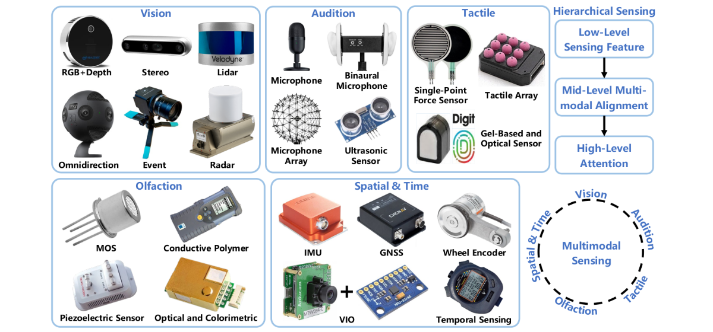

Miguel Xochicale

# 

**From Code to Care:**  
The Role of Physical &  
Embodied AI in Healthcare 

    
 Miguel Xochicale  
[
`physical-and-embodied-ai-in-healthcare`](https://mxochicale.github.io/physical-and-embodied-ai-in-healthcare)

Q4-2025

[`open-healthcare-slides`](https://github.com/mxochicale/physical-ai-in-healthcare-slides/)

<!-- *********************** NEW SLIDE *********************** -->

# Overview

- [What is Embodied AI and Physical AI?](#epai)
- [Intro to Embodied AI](#intro_eai)
- [Section title 3](#sectag_title_3) <!--  Comments -->
  <!--  * [Open-Source Software in Healthcare](#sec-ossh) -->

<!-- *********************** NEW SLIDE *********************** -->

# What is Embodied AI and Physical AI?

What are their roles in Healthcare?

Notes goes here

<!-- *********************** NEW SLIDE *********************** -->

## Key Differences

Embodied AI

- **Definition:** AI with a physical form (robots, self-driving cards)
  integreated into the environment.
- **Focus:** Learning and adapting through physical interactions with
  the environment.
- **Tech:** Real-world sensors and actuators for live perception and
  action.
- **Goal:** To adapt and make intelligence decisions through physical
  engagement.

Physical AI

- **Defintion:** Any AI that models, reasons, or predicts aspects of the
  physical world.
- **Focus:** Understanding and reasoning about physical and virtual
  worlds.
- **Tech:** Virtual environments, synthetic data generation, and
  simulation tools.
- **Goal:** To develop models that understand and predict the dynamics
  of the physical world.

🤖 Speaker notes go here.

https://medium.com/@thevalleylife/ai-terms-explained-embodied-ai-vs-physical-ai-2ad3bec23792

https://www.linkedin.com/pulse/physical-ai-convergence-embodied-living-intelligence-kai-xin-thia-76kkc 1.
Embodied AI and the Rise of Generalist Robot Policies 2. The Role of
Simulation and Synthetic Data Generation in Physical AI 3. From LLMs to
LAMs: Towards Action-Oriented AI 4. Bioengineering and the Potential of
Organoid Intelligence

https://www.linkedin.com/pulse/understanding-physical-ai-embodied-agentic-prabhjot-kaur-gosal-ph-d–ojrac
\* Embodied AI: This is the easiest one to explain. Basically, when AI
is integrated into a physical entity, it is called embodied AI (AI in a
physical body). Examples include a self-driving car, robot, etc. \*
Physical AI: I see this as an ecosystem/simulation world that mimics the
real world. It essentially provides training field for the embodied AI.
I also see this as a synonym of digital twin. \* Agentic AI: Agent is
any entity that can make decisions autonomously to achieve a certain
goal. This goal may or may not require the agent to interact with the
physical world/things.

https://www.nvidia.com/en-us/glossary/generative-physical-ai/ \* How
Does Physical AI Work? \* What Is the Role of Reinforcement Learning in
Physical AI? \* Why Is Physical AI Important? \* How Can You Get Started
With Physical AI? \* Construct a virtual 3D environment \* Generate
3D-to-real synthetic data \* Train and validate \* Deploy

<!-- *********************** NEW SLIDE *********************** -->

## The Role of Physical & Embodied AI in Healthcare

- Robotic Surgery
- AI-Enhanced Medical Devices
- Hospital and Patient Care Automation
- Rehabilitation & Assistive Robots
- Remote Care and Telepresence
- Diagnostics with Physical and Embodied AI
- Elderly & Patient Care Robots

🤖 Speaker notes go here.

<!-- *********************** NEW SLIDE *********************** -->

## Few benefits and challenges

Benefits

- Greater precision and efficiency in treatment.
- Reduced human error in procedures.
- Improved patient monitoring and personalized care.
- Relief for healthcare workers facing labor shortages.
- Augment human healthcare workers

Challenges

- Safety and reliability in high-stakes clinical settings.
- Data Privacy and Security
- Ethical issues: autonomy, patient trust, and job displacement.
- High costs and integration with existing healthcare infrastructure.
- Regulatory hurdles and ethical considerations.

🤖 Speaker notes go here.

<!-- *********************** NEW SLIDE *********************** -->

# Intro to Embodied AI

Notes goes here

<!-- *********************** NEW SLIDE *********************** -->

## Multimodal Sensing

Fig 11 from **Liu et al. 2025** “Neural Brain: A Neuroscience-inspired
Framework for Embodied Agents.” arXiv preprint
https://arxiv.org/abs/2505.07634

Speaker notes go here.

Getting started documentation provide with a range of links to setup,
use, run and debug application including github workflow.

Figure 1

<!-- *********************** NEW SLIDE *********************** -->

## Action mechanisms of Embodied AI

Fig 15 from **Liu et al. 2025** “Neural Brain: A Neuroscience-inspired
Framework for Embodied Agents.” arXiv preprint
https://arxiv.org/abs/2505.07634

Speaker notes go here.

<!-- *********************** NEW SLIDE *********************** -->

# Section title 3

Subsection title

Notes goes here

<!-- *********************** NEW SLIDE *********************** -->

##  Github: Getting started docs

Figure 2: Getting started documentation provide with a range of links to
setup, use, run and debug application including github workflow.

**Sciortino et al. 2017** in Computers in Biology and Medicine
https://doi.org/10.1016/j.compbiomed.2017.01.008;  
**He et al. 2021** in Front. Med.
https://doi.org/10.3389/fmed.2021.729978

Speaker notes go here.

<!-- *********************** NEW SLIDE *********************** -->

## Title of the slide

- Bullet point 1
- Bullet point 2
- **Bullet point** 3
  - Bullet point 3.1
  - Bullet point 3.2

**Sciortino et al. 2017** in Computers in Biology and Medicine
https://doi.org/10.1016/j.compbiomed.2017.01.008;  
**He et al. 2021** in Front. Med.
https://doi.org/10.3389/fmed.2021.729978

Notes goes here

<!-- *********************** NEW SLIDE *********************** -->

# Extra slides

Notes goes here

<!-- *********************** NEW SLIDE *********************** -->

## My Journey

Notes goes here for my journey

